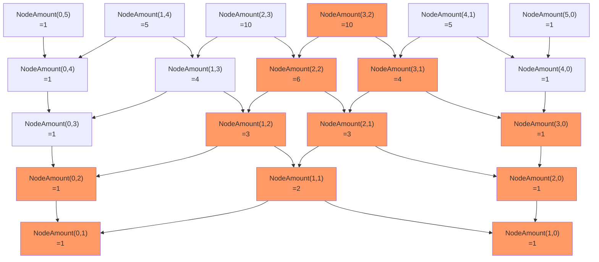

# Exercise 1.14

```mermaid
  graph TD;
    root["(count-change 11)"]-->cc-11-5["(cc 11 5)"];
    cc-11-5-->cc-11-4["(cc 11 4)"]
    cc-11-4-->cc-11-3["(cc 11 3)"]
    cc-11-3-->cc-11-2["(cc 11 2)"]
    cc-11-2-->cc-11-1["(cc 11 1)"]
    cc-11-1-->cc-11-0["(cc 11 0)"]
    cc-11-0-->zero1(0)
    cc-11-1-->cc-10-1["(cc 10 1)"]
    cc-10-1-->cc-10-0["(cc 10 0)"]
    cc-10-0-->zero2(0)
    cc-10-1-->cc-9-1["(cc 9 1)"]
    cc-9-1-->cc-9-0["(cc 9 1)"]
    cc-9-0-->zero3(0)
    cc-9-1-->cc-8-1["(cc 8 1)"]
    cc-8-1-->cc-8-0["(cc 8 0)"]
    cc-8-0-->zero4(0)
    cc-8-1-->cc-7-1["(cc 7 1)"]
    cc-7-1-->cc-7-0["(cc 7 0)"]
    cc-7-0-->zero5(0)
    cc-7-1-->cc-6-1["(cc 6 1)"]
    cc-6-1-->cc-6-0["(cc 6 0)"]
    cc-6-0-->zero6(0)
    cc-6-1-->cc-5-1["(cc 5 1)"]
    cc-5-1-->cc-5-0["(cc 5 0)"]
    cc-5-0-->zero7(0)
    cc-5-1-->cc-4-1["(cc 4 1)"]
    cc-4-1-->cc-4-0["(cc 4 0)"]
    cc-4-0-->zero8(0)
    cc-4-1-->cc-3-1["(cc 3 1)"]
    cc-3-1-->cc-3-0["(cc 3 0)"]
    cc-3-0-->zero9(0)
    cc-3-1-->cc-2-1["(cc 2 1)"]
    cc-2-1-->cc-2-0["(cc 2 0)"]
    cc-2-0-->zero10(0)
    cc-2-1-->cc-1-1["(cc 1 1)"]
    cc-1-1-->cc-1-0["(cc 1 0)"]
    cc-1-0-->zero11(0)
    cc-1-1-->cc-0-1["(cc 0 1)"]
    cc-0-1-->one1(1)
    cc-11-2-->cc-6-2["(cc 6 2)"]
    cc-6-2-->cc-6-1-1["(cc 6 1)"]
    cc-6-1-1-->cc-6-0-1["(cc 6 0)"]
    cc-6-0-1-->zero12(0)
    cc-6-1-1-->cc-5-1-1["(cc 5 1)"]
    cc-5-1-1-->cc-5-0-1["(cc 5 0)"]
    cc-5-0-1-->zero13(0)
    cc-5-1-1-->cc-4-1-1["(cc 4 1)"]
    cc-4-1-1-->cc-4-0-1["(cc 4 0)"]
    cc-4-0-1-->zero14(0)
    cc-4-1-1-->cc-3-1-1["(cc 3 1)"]
    cc-3-1-1-->cc-3-0-1["(cc 3 0)"]
    cc-3-0-1-->zero15(0)
    cc-3-1-1-->cc-2-1-1["(cc 2 1)"]
    cc-2-1-1-->cc-2-0-1["(cc 2 0)"]
    cc-2-0-1-->zero16(0)
    cc-2-1-1-->cc-1-1-1["(cc 1 1)"]
    cc-1-1-1-->cc-1-0-1["(cc 1 0)"]
    cc-1-0-1-->zero17(0)
    cc-1-1-1-->cc-0-1-1["(cc 0 1)"]
    cc-0-1-1-->one2(1)
    cc-6-2-->cc-1-2["(cc 1 2)"]
    cc-1-2-->cc-1-1-2["(cc 1 1)"]
    cc-1-1-2-->cc-1-0-2["(cc 1 0)"]
    cc-1-0-2-->zero18(0)
    cc-1-1-2-->cc-0-1-2["(cc 0 1)"]
    cc-0-1-2-->one3(1)
    cc-1-2-->cc=4-2["(cc -4 2)"]
    cc=4-2-->zero19(0)
    cc-11-3-->cc-1-3["(cc 1 3)"]
    cc-1-3-->cc-1-2-1["(cc 1 2)"]
    cc-1-2-1-->cc-1-1-3["(cc 1 1)"]
    cc-1-1-3-->cc-1-0-3["(cc 1 0)"]
    cc-1-0-3-->zero20(0)
    cc-1-1-3-->cc-0-1-3["(cc 0 1)"]
    cc-0-1-3-->one4(1)
    cc-1-2-1-->cc=4-2-1["(cc -4 2)"]
    cc=4-2-1-->zero21(0)
    cc-1-3-->cc=9-3["(cc -9 3)"]
    cc=9-3-->zero22(0)
    cc-11-4-->cc=14-4["(cc -14 4)"]
    cc=14-4-->zero23(0)
    cc-11-5-->cc=39-5["(cc -39 5)"]
    cc=39-5-->zero24(0)
```

In total, we have 4 of `1` and 24 of `0`. So the result of `(count-change 11)` is `4`

It runs `55` steps (total amount of nodes) and need `15` spaces (maximum depth).

The root node `(count-change n)` will be evaluated to `(cc n 5)`, and `(cc n 5)` will be evaluated to two nodes, `(cc n 4)` and `(cc (- n (first-denomination 5)) 5)` and so on.

More general speaking, every node `(cc n m)` will be evaluated to another two nodes `(cc n (- m 1))` and `(cc (- n (first-denomination m)) m)` until either of `n` or `m` equals `0`.

Although the exact amount of the nodes depends on the series values of `(first-denomination m)`, the worst case is that all the values of `(first-denomination m)` are `1`. That means every node `(cc n m)` will be evaluated to `(cc (- n 1) m)` and `(cc i (- m 1))`. In total, it is the maximum amount of all the nodes.

Therefore the amount nodes of `(count-change n)` in the worst case is

$$
  NodeAmount(n, m) = NodeAmount(n-1, m) + NodeAmount(n, m-1)
$$

And there are two exits for this double recursion:

$$
  NodeAmount(0, m) = 1 \\
  NodeAmount(n, 0) = 1 \\
$$

So we can infer it is just the combination of `n` and `n+m` because the recursions and exits are exactly the same.

$$
\dbinom{n+m}{n} = \dbinom{n+m-1}{n-1} + \dbinom{n+m-1}{n}
$$
$$
\dbinom{m}{0} = 1, 
\dbinom{n}{n} = 1
$$
$$
\therefore NodeAmount(n, m) = \dbinom{n+m}{n}
$$

In addition, we can see that the invocation tree graph of `(cc n m)` in the worst case is the composition of the parial section of the **inversed Pascal's triangle**. For example:



Now apparently the level of invocation tree of `(cc n m)` equals to $n+m$, and the upper bound of the node amount of the invocation tree of `(cc n m)` equals to $\dbinom{n+m}{n}$.

In conclusion, when `m` is regarded as a constant as `5`, the order of growth of the space is $\Omicron(n)$ and the order of number of steps is $\Omicron(n^5)$